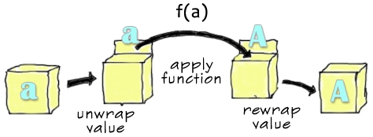

<!-- LTeX: language=es -->

Hace unos días tuve una conversación con mi equipo sobre el uso de la función `map` en Rust. Como
puede resultar didáctico para aquellos que quieran saber más sobre Programación Funcional he
decidido reproducirlo por aquí.

Ciertamente, la concepción más popular de `map` (y también las otras dos entidades que forman la "triada" de
 funciones de orden superior, `filter` y `reduce` o `fold`) viene de su uso en iteradores como listas,
 *arrays*, etc. Esto no solo ocurre en Rust sino también en otros lenguajes como JavaScript.

Sin embargo, en algunos casos puede ser útil abstraer nuestra concepción de `map` un poco más para
razonar mejor cómo se comporta en otros contextos. Por ejemplo, ¿qué hay de los tipos `Option` y
`Result` en Rust? ¿por qué tienen una implementación de `map`?

Una manera útil de comprender la función `map` que también abarca su disponibilidad como método en
`Option` y `Result` es considerarla como una función implementable para tipos de datos similares a
*contenedores*. De esta forma, `map` opera aplicando la función pasada como parámetro al
*valor del tipo contenido*, sustituyéndolo por el valor de salida de la aplicación,
dejando el *contenedor* intacto.

Así, un valor de tipo `Option<T>` se transforma en un valor de tipo `Option<U>` si llamamos a la
función `map` pasándole una función que implemente `Fn(T) -> U`[^fnonce] que transformará `T` en
`U`, dejando el *envoltorio* `Option<_>` intacto.

`Result` es un poco más interesante. Es un tipo de dato con dos variantes, igual que `Option`, pero
a diferencia de este, `Result` incluye un tipo en cada variante. La implementación de `map` para
`Result` solo actúa en una de sus posibles variantes (`Ok(_)`) ignorando la otra.

> [!tip] ¿Por qué `Ok` y no `Err`?
> Dado que `Result` se usa habitualmente en situaciones en las que propagamos los errores
> en la variante `Err(_)` usando `?`, nos importa la primera ocurrencia de la variante `Err(_)`.
>
> La función `map`, pues, no actúa sobre la variante `Err(_)`[^maperr-maporelse].

Entonces, partiendo de un `Result<T, E>` obtenemos un `Result<U, E>` pasando un
`Fn(T) -> U`[^fnonce]. De nuevo, el valor de tipo `T` se transforma en un valor de tipo `U` pero el
*envoltorio* `Result<_, E>` permanece inalterado.

¡Pero podríamos tener `map`s para muchos otros tipos! ¿Por qué no una tupla con dos (o más)
elementos, como `(T, U)`? ¿Tiene sentido usar `map` aquí? ¿Por qué no un `struct` arbitrario que
hayamos definido?

¿Tendría sentido la existencia de un *trait* llamado `Mappable` o algo parecido?
*¡La respuesta es sí!*

En lenguajes de programación funcional como Haskell, el comportamiento de `map` está definido en
lo equivalente a un *trait* de Rust (en dicho lenguaje, los *traits* se llaman *typeclasses*).
Este *trait* se llama `Functor`. La [documentación](https://hackage.haskell.org/package/base-4.20.0.1/docs/Prelude.html#t:Functor) sobre `Functor`, aunque algo matemática, parece estar de acuerdo con nuestro razonamiento anterior:

> Un tipo `f` es un `Functor` si proporciona una función `fmap` que, dados dos tipos arbitrarios `a`
> y `b` permite aplicar cualquier función `(a -> b)` transformando `f a` en un `f b`, preservando la
> estructura de `f`.

La función se llama `fmap` en lugar de `map` por razones históricas (`map` se definió inicialmente,
cómo no, para usarse con listas, luego fue generalizada) y facilidad de uso (los novatos en Haskell
comienzan usando `map` solo en listas y más adelante aprenden la abstracción para usar `fmap`).

Existen implementaciones de `Functor` para muchos tipos en el ecosistema de Haskell, como para:

- Listas
- Conjuntos
- Mapas
- `Maybe` (el `Option` de Rust)
- `Either` (el `Result` de Rust)
- Tuplas de varios elementos
- La aplicación de funciones en sí misma (¿Cuál podría ser la implementación de esto?)
- y muchos otros, en creciente nivel de abstracción, para las que nuestra analogía de
**tipos contenedores** empieza a quedarse corta[^functor-not-box].

Las otras funciones típicas de la programación funcional que mencionamos al principio, `filter` y
`fold` o `reduce`, tienen sus propios *traits* o *typeclasses*: [`Filterable`](https://hackage.haskell.org/package/witherable-0.5/docs/Witherable.html#t:Filterable) y [`Foldable`](https://hackage.haskell.org/package/base-4.20.0.1/docs/Prelude.html#t:Foldable).

¿Por qué entonces este `Functor` (o `Filterable` o `Foldable`) no está disponible en Rust? Por la
sencilla razón de que Rust por ahora no puede representar fácilmente *traits* de este tipo que sean
lo suficientemente genéricos. Un buen ejercicio podría ser intentarlo, partiendo de alguno sencillo
como `Option` y tratar de definir `Functor` e implementarlo para todo `T` (¡y `U`!) de `Option<T>`,
quizá usando [tipos asociados genéricos](https://blog.rust-lang.org/2022/10/28/gats-stabilization.html#what-are-gats).

Para poder expresar esto de forma ergonómica, Rust tendría que soportar lo que se conoce como
*higher-kinded types*. No sé cómo se traduciría esto al español, ¿*Tipos de clasificación superior*, tal vez?

No dejes que el no poder expresar estos conceptos en Rust u otros lenguajes te impida razonar sobre
qué puede representar realmente la función `map` y qué podría cualificar a un tipo como *mapeable*.

¡Hasta otra!

[^fnonce]:
    Realmente en Rust es [`FnOnce(T) -> U`](https://doc.rust-lang.org/std/option/enum.Option.html#method.map), pero esto es otra discusión.

[^maperr-maporelse]:
    Aunque también existe [`map_err`](https://doc.rust-lang.org/std/result/enum.Result.html#method.map_err) para actuar sobre la variante `Err(_)` o [`map_or_else`](https://doc.rust-lang.org/std/result/enum.Result.html#method.map_or_else) para
    actuar sobre las dos variantes, generando un único tipo de salida `U`.

[^functor-not-box]
    [Un functor no es una caja.](https://cs-syd.eu/posts/2016-04-30-a-functor-is-not-a-box)
